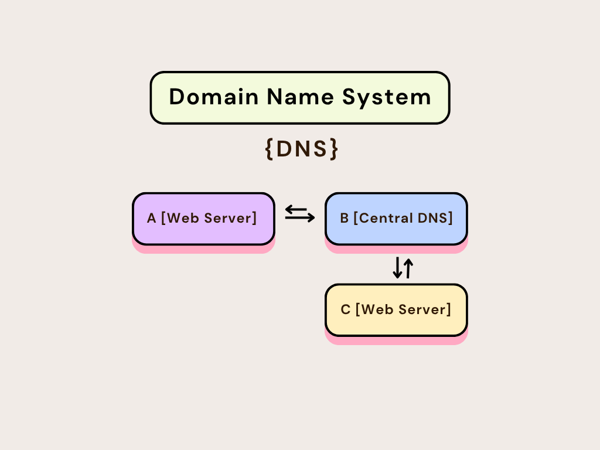
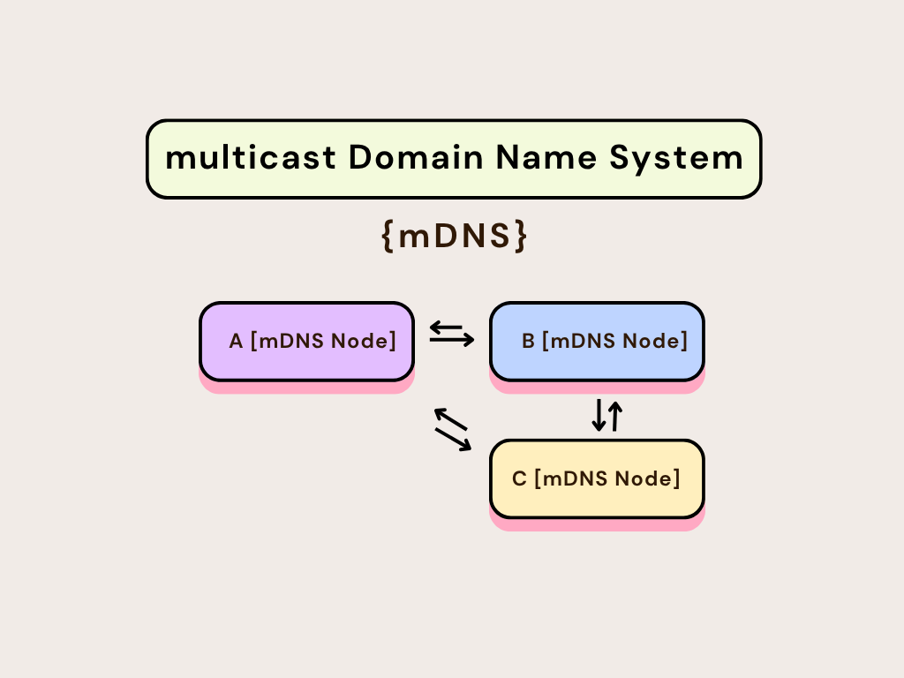
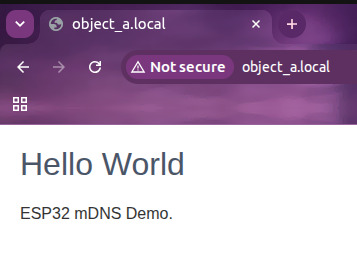

# ESP32 mDNS Web Server Demo

A lightweight ESP-IDF project demonstrating how to set up an HTTP web server and use the Multicast DNS (mDNS) responder service on an ESP32 chip.

This allows you to access a web page hosted on your ESP32 device using a friendly local hostname (e.g., `http://object_a.local/`) rather than typing its dynamic IP address.

---

## Understanding mDNS (Multicast DNS)

In traditional networking, when you type a domain name (like `google.com`) into your browser, a central **DNS (Domain Name System)** server resolves that domain into an IP address. On local home or office networks, however, setting up and maintaining a local DNS server can be complicated and impractical. This is where **mDNS** comes in.

### How mDNS Works
- **Zero Configuration (ZeroConf):** mDNS (defined in [RFC 6762](https://datatracker.ietf.org/doc/html/rfc6762)) operates peer-to-peer without requiring a central server.
- **Multicast Queries:** When a client wants to resolve a local hostname like `object_a.local`, it sends a multicast query packet to the local network (IPv4 address `224.0.0.251` or IPv6 address `ff02::fb` on UDP port `5353`).
- **Direct Responses:** Every mDNS-enabled device on the network listens to this multicast address. The device claiming the hostname `object_a` (here, our ESP32) responds directly by broadcasting its IP address to the network.
- **The `.local` TLD:** The `.local` Top-Level Domain is specifically reserved for link-local networks. Standard DNS servers ignore these queries, leaving them to be resolved strictly by mDNS.

### A Concrete Example: Traditional DNS vs. mDNS (Nodes A, B, and C)

To see the difference, imagine three devices (or objects) on a local network: **Device A**, **Device B**, and **Device C**.

#### Scenario 1: Traditional Centralized DNS (or Host Files)



Suppose **Device B** is acting as a central server (or local DNS resolver / coordinator) that maintains a mappings database (like a hosts file or DNS record list).
1. **Device C** wants to request information from **Device A**.
2. **Device C** doesn't know where **Device A** is. It has to query the central coordinator **Device B**: *"Where is Device A?"*
3. **Device B** looks up its local configuration database/files and replies: *"Device A is at IP 192.168.1.10"*.
4. **Device C** can then contact **Device A**.
* **The Problem:** If Device B goes offline, or if its configuration files are incorrect, Device C can no longer find Device A. Every time a device joins or changes its IP address, the central server (Device B) must be manually or dynamically updated.

#### Scenario 2: Decentralized mDNS (The Peer-to-Peer Approach)



With mDNS, there is no central server B. **Every device (A, B, and C) acts as its own DNS server.**
1. **Device C** wants to connect to **Device A** (`object_a.local`).
2. **Device C** simply broadcasts a query to the entire network: *"Who has the hostname `object_a.local`?"*
3. **Device B** hears the query but ignores it because its hostname is not `object_a`.
4. **Device A** hears the query, recognizes its own name, and responds directly: *"I am `object_a.local`, and my IP is 192.168.1.10"*.
5. **Device C** receives the answer and connects directly.
* **The Solution:** By removing the central authority, mDNS turns all devices into peer servers that publish their own domain names and services locally. It requires zero configuration, works instantly out of the box, and handles dynamic IP changes gracefully.

### Service Discovery (DNS-SD)
Beyond basic hostname resolution, mDNS supports **DNS-Based Service Discovery (DNS-SD)** (defined in [RFC 6763](https://datatracker.ietf.org/doc/html/rfc6763)). This allows devices to advertise their capabilities:
- **Service Name & Protocol:** Our ESP32 advertises a web server using the format `_http._tcp` (HTTP web service over TCP protocol).
- **Port:** It broadcasts that the service is running on port `80`.
- **TXT Records:** It provides additional attributes in key-value format (such as `path=/`), helping applications (like Apple's Bonjour or Linux's Avahi) automatically discover and connect to the web server without user configuration.

---

## Features

- **Wi-Fi STA mode initialization**: Connects automatically to a configured local Wi-Fi Access Point with retry logic.
- **Embedded Web Server**: Starts a lightweight HTTP server on port `80` serving a clean, responsive "Hello World" HTML page.
- **mDNS Responder Service**:
  - Registers the hostname `object_a.local` on the local network.
  - Broadcasts the service `ESP32-WebServer` under `_http._tcp` protocols on port `80`.
  - Attaches TXT records (e.g., `path=/`) to advertise capability details.
- **NVS Initialization**: Initializes the Non-Volatile Storage (NVS) flash required for storing Wi-Fi configuration and states.

---

## Technical Details

- **Core Framework**: [ESP-IDF](https://docs.espressif.com/projects/esp-idf/en/latest/esp32/) (Compatible with versions `>= 4.1.0`)
- **Key Modules Used**:
  - `esp_wifi` for station mode management.
  - `esp_http_server` for processing GET requests on `/`.
  - `mdns` for local domain name resolution and service advertising.
  - `nvs_flash` for storing system credentials.

---

## Getting Started

### Prerequisites

1. Set up the **ESP-IDF development environment**. For setup guides, see the [Espressif Getting Started Guide](https://docs.espressif.com/projects/esp-idf/en/latest/esp32/get-started/index.html).
2. Ensure you have an ESP32, ESP32-S, or ESP32-C series development board connected to your computer.

### Project Layout

```text
├── CMakeLists.txt         # Project-level CMake definition
├── sdkconfig              # SDK Configuration cache
├── managed_components/    # Automatically downloaded external components
├── main/
│   ├── CMakeLists.txt     # Component-level CMake definition
│   ├── idf_component.yml  # Dependency configuration (e.g. espressif/mdns)
│   └── mDNS.c             # Main source code containing server & WiFi initialization
└── README.md              # Project documentation (this file)
```

---

## Configuration

Before flashing the application to your ESP32, you will need to configure your Wi-Fi credentials:

1. Open [main/mDNS.c](file:///Users/omkar/Desktop/mDNS/main/mDNS.c).
2. Locate the `wifi_init_sta` function configuration structure:
   ```c
   wifi_config_t wifi_config = {
       .sta = {
           .ssid = "YOUR_WIFI_SSID",      // Replace with your WiFi SSID
           .password = "YOUR_PASSWORD",  // Replace with your WiFi password
           .threshold.authmode = WIFI_AUTH_WPA2_PSK,
       },
   };
   ```
3. Update `.ssid` and `.password` with your local Wi-Fi connection details.
4. *(Optional)* Modify the mDNS hostname inside the `start_mdns_service` function:
   ```c
   ESP_ERROR_CHECK(mdns_hostname_set("object_a")); // Resolves to http://object_a.local/
   ```

---

## How to Build & Flash

Run the following commands using the ESP-IDF command line terminal:

1. **Set the Target Chip** (e.g., `esp32`, `esp32s3`, or `esp32c3`):
   ```bash
   idf.py set-target esp32
   ```

2. **Configure the Project** (Optional, if you wish to adjust default SDK parameters):
   ```bash
   idf.py menuconfig
   ```

3. **Build the Project**:
   ```bash
   idf.py build
   ```

4. **Flash and Monitor**:
   Replace `<PORT>` with the serial port of your ESP32 board (e.g., `/dev/cu.usbserial-XXX` on macOS/Linux or `COM3` on Windows).
   ```bash
   idf.py -p <PORT> flash monitor
   ```
   *Tip: You can use `Ctrl + ]` to exit the ESP-IDF monitor.*

---

## Verification & Usage

1. Watch the terminal monitor output. Once the ESP32 connects to your Wi-Fi network successfully, you should see logs similar to:
   ```text
   I (2450) mDNS_demo: Got IP: 192.168.1.104
   I (2455) mDNS_demo: Connected to AP SSID: life
   I (2460) mDNS_demo: Initializing mDNS service...
   I (2465) mDNS_demo: mDNS responder started with hostname: object_a
   I (2470) mDNS_demo: Starting Web Server...
   I (2475) mDNS_demo: Starting HTTP server on port: '80'
   I (2480) mDNS_demo: Registering URI handler for '/'
   ```

2. Make sure your computer or smartphone is connected to the **same Wi-Fi network** as the ESP32.

3. **Access the web interface**:
   - Open your browser and navigate to: [http://object_a.local](http://object_a.local)
   - You should see a simple webpage rendering:
     > **Hello World**
     >
     > ESP32 mDNS Demo.

   

4. **Query mDNS using CLI**:
   You can also verify that the mDNS responder is working on your local network using terminal commands:
   - **Ping the device**:
     ```bash
     ping object_a.local
     ```
   - **Resolve the HTTP service** (macOS/Linux):
     ```bash
     dns-sd -B _http _tcp local
     ```
     or
     ```bash
     avahi-browse -r _http._tcp
     ```
